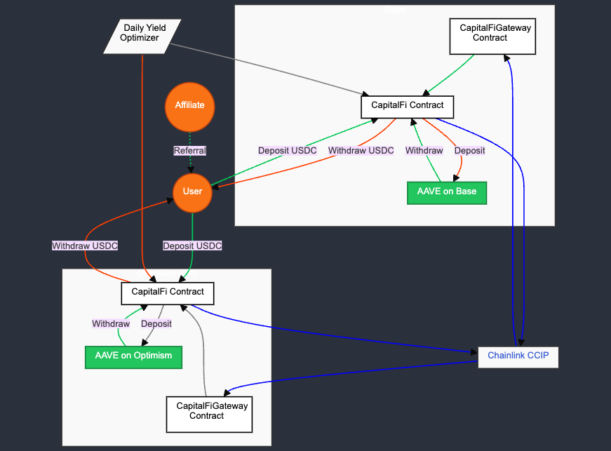

# Capital Finance - The Best Superchain Yield Aggregator

  

## Overview

This project implements an advanced cross-chain yield aggregator for USDC, currently operational on Optimism and Base blockchains. It allows users to deposit USDC and earn optimized yield across different chains, leveraging the best available rates while ensuring top-notch security through Chainlink's Cross-Chain Interoperability Protocol (CCIP).

## Contract Addresses

- CapitalFi (Optimism):

[https://optimism.blockscout.com/address/0xaf5eDa95b87fCf9767cED0d9c01b69e0A976C725?tab=contract](https://optimism.blockscout.com/address/0xaf5eDa95b87fCf9767cED0d9c01b69e0A976C725?tab=contract)

[CCIP Explorer](https://ccip.chain.link/address/0xaf5eDa95b87fCf9767cED0d9c01b69e0A976C725)

- CapitalFiGateway (Optimism): [https://optimism.blockscout.com/address/0x0A9723b00f835145751b9183775aF2a52e406Ebe?tab=contract](https://optimism.blockscout.com/address/0x0A9723b00f835145751b9183775aF2a52e406Ebe?tab=contract)

[CCIP Explorer](https://ccip.chain.link/address/0x0A9723b00f835145751b9183775aF2a52e406Ebe)

- CapitalFi (Base): [https://base.blockscout.com/address/0x170537A78FA4ca63AB849D208bEE8fD3Ab1fAc97?tab=contract](https://base.blockscout.com/address/0x170537A78FA4ca63AB849D208bEE8fD3Ab1fAc97?tab=contract)

[CCIP Explorer](https://ccip.chain.link/address/0x170537A78FA4ca63AB849D208bEE8fD3Ab1fAc97)

- CapitalFiGateway (Base): [https://base.blockscout.com/address/0x482b052dD873744c3e3722abE50735b0aA849556?tab=contract](https://base.blockscout.com/address/0x482b052dD873744c3e3722abE50735b0aA849556?tab=contract)

[CCIP Explorer](https://ccip.chain.link/address/0x482b052dD873744c3e3722abE50735b0aA849556)

## Features

- Deposit USDC on Optimism or Base
- Earn optimized yield through AAVE lending protocols across multiple chains, we are working on integrating more protocols
- Cross-chain transfers for dynamic yield optimization
- Automated yield rebalancing for maximum returns
- User-friendly interface for deposits, withdrawals, and yield tracking
- High-security cross-chain operations using Chainlink's CCIP
- Affiliate program for user acquisition

## Architecture

The system consists of two main smart contracts:

1. CapitalFi Contract (on each supported chain)
2. CapitalFiGateway Contract (on each supported chain)

These contracts interact with AAVE lending pools on their respective chains and utilize Chainlink's CCIP for secure inter-chain communications and transfers.

  

## Optimized Yield Aggregation

Our yield aggregator implements several strategies to maximize returns for users:

1. Multi-chain Yield Comparison: Continuously monitors yield rates across supported chains (currently Optimism and Base).
2. Dynamic Rebalancing: Automatically moves funds between chains to capture the highest yield opportunities.
3. Gas-Optimized Transfers: Utilizes Chainlink's CCIP for efficient and secure cross-chain operations.
4. Compounding: Regularly reinvests earned yield to maximize overall returns.
5. Risk Management: Diversifies funds across multiple protocols and chains to mitigate potential risks.

## Chainlink CCIP Integration

We leverage Chainlink's Cross-Chain Interoperability Protocol (CCIP) for managing cross-chain fund transfers with industry-leading security:

- 7 Layers of Security: CCIP provides seven distinct layers of security to ensure the integrity and safety of cross-chain transactions.
- Decentralized Validation: Utilizes a decentralized oracle network for transaction validation.
- Risk Management: Implements various risk management techniques, including circuit breakers and rate limiting.
- Robust Message Passing: Ensures reliable and verifiable message passing between different blockchain networks.

## Smart Contract Functions

### CapitalFi Contract

- `userDeposit(address _token, uint256 _amount, address _affiliateAddress, uint256 _affiliateAmount)`: Allows users to deposit USDC and optionally pay an affiliate.
- `userWithdraw(address _token, address _aToken, uint256 _shares)`: Enables users to withdraw their funds and earned yield.
- `supplyToDefi(address _token)`: Supplies protocol USDC to the AAVE lending pool.
- `withdrawFromDefi(address _token, address _aTokenAddr)`: Withdraws protocol USDC from the AAVE lending pool.
- `bridgeAndSupplyToDefi(...)`: Bridges tokens to a different chain and supplies them to the DeFi protocol.
- `withdrawBridgeAndSupply(...)`: Withdraws tokens from AAVE, bridges them to a different chain, and supplies them to the DeFi protocol on the destination chain.

### CapitalFiGateway Contract

- `_ccipReceive(Client.Any2EVMMessage memory message)`: Handles incoming CCIP messages and transfers received tokens to the CapitalFi contract.
- `withdraw()`: Allows the owner to withdraw Ether from the contract.
- `withdrawToken(address token)`: Enables the owner to withdraw ERC20 tokens from the contract.

## Future Developments

- Integration with additional DeFi protocols beyond AAVE
- Expansion to more blockchain networks
- Implementation of advanced yield optimization algorithms
- Enhanced governance features for protocol parameters
